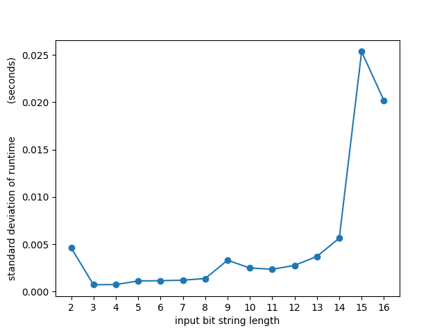
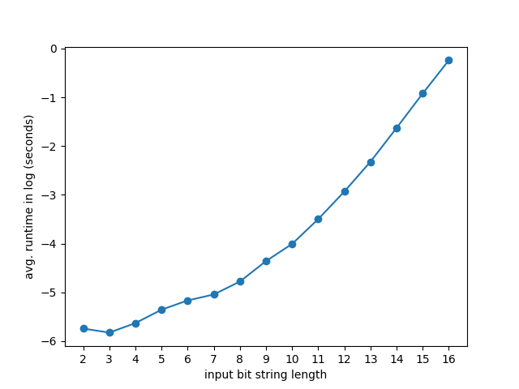
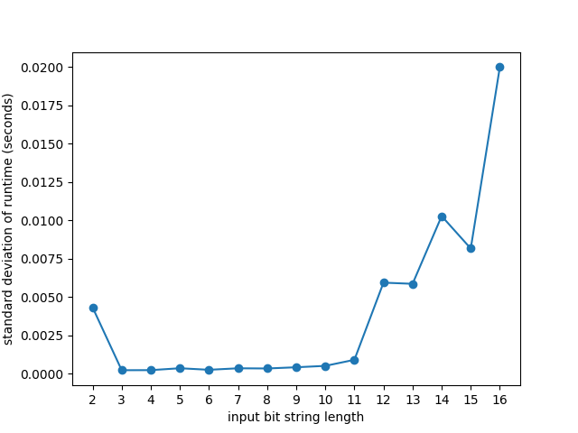
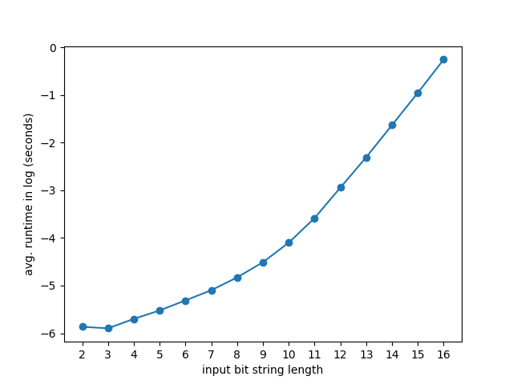
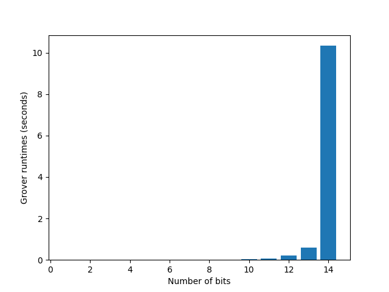

# Deutsch-Jozsa

## Usage

This python script can be used to perform two things:

1. Run benchmarks on Deutsch-Jozsa algorithm implemented in Cirq that study:
   1. How the execution time depends on the choice of f (of Z_f)
   2. How the execution time depends on n, the input size
2. Run Grover algorithm on an f with specified input bit-string length n

To run the two benchmarks, do

```bash
python3 ./deutsch-jozsa.py --benchmark
```

To run Grover algorithm on a function f generated with your specified parameters, do

``` bash
python3 ./deutsch-jozsa.py --num_bits $n --type $t
```

where `n` is the lenght of the input bit string to function f, and `t` can be an int in {0, 1, -1} to specify that the generated f is balanced, constant or at random.
For example, `python3 ./my_grover.py --num_bits 10 --type -1` means to run the Deutsch-Jozsa algorithm on f(x) that takes a 10-bit string which is generated to be constant or balance at random.


## Understanding the Output

### Benchmark

To study "How the execution time depends on the choice of f (of Z_f)", the script will randomly generate 100 function f with input size ranging from 2 to 16 with step size 1. After the executing the Deutsch-Jozsa algorithm on all the functions, we will report the mean and standard deviation of the runtime in file `dj_time_mean.pdf` and `dj_time_std.pdf` respectively.

### Custom input function

Our script will simulate Deutsch-Jozsa algorithm on a function f specified by your input and print out: function type, circuit for the algorithm, measurement result, and runtime. Here is an example run which is pretty self-explanatory.

```
generate balanced f
Circuit:
0: ───H───────@───H───M('result-0')───────────────────────────────────────────────────
              │
1: ───H───────┼───@───H───────────────M('result-1')───────────────────────────────────
              │   │
2: ───H───────┼───┼───@───────────────H───────────────M('result-2')───────────────────
              │   │   │
3: ───H───────┼───┼───┼───────────────@───────────────H───────────────M('result-3')───
              │   │   │               │
4: ───X───H───X───X───X───────────────X───────────────────────────────────────────────
result-0=1
result-1=1
result-2=1
result-3=1
finish in 0.011569200000000057 seconds
```

Here, the Deutsch-Jozsa circuit is run and measures the four qubits to be (1, 1, 1, 1), indicating that the black-box function f is a balanced function, which is consistent with the message `generate balanced f` in the generation of f.


## Report

### Present the design of how you implemented the black-box function U_f.  

The design of U_f follows https://qiskit.org/textbook/ch-algorithms/deutsch-jozsa.html. For constant function f, if  f(x) = 0 for all x, then no gates in U_f; if f(x) = 1 for all x, then only gate X is added to the output qubit. For balanced function f, it is implemented by adding CNOT gates to each qubit except the output qubit, all targeted at the output qubit. An example illustration is as follows.


Here is the code that implements the logic:

```python
def make_oracle(qbts, n, constant = -1, visual = False):
    """
    Input:    
    qbts -- qubits in the circuit;
    n -- length of the input bit string;
    constant -- 1 for generate a constant f, 0 for generate a balanced f, 
        -1 for f being constant or balanced at random;
    Output:
    oracle -- gate implementation of f
    """
    if constant < 0:
        constant = random.randint(0, 1)
    
    if constant:  # f being constant
        if visual:
            print("generate constant f")
        if random.randint(0, 1):  # constant output of f
            return [X(qbts[-1])]
        else:
            return []
    else:
        if visual:
            print("generate balanced f")
        gates = []
        for qbt in qbts[:-1]:
            if random.randint(0, 1):  # randomly flip qubits          
                gates.extend([X(qbt), CNOT(qbt, qbts[-1]), X(qbt)])
            else:
                gates.append(CNOT(qbt, qbts[-1]))
        return gates
```


### Present the design of how you parameterized the solution in n.

Our script support dynamic generation of f. The function `run_algo` support `n` as its input and choose qubits according to `n` to construct the quantum circuit.

### Discuss the number of lines and percentage of code that your four programs share. 

Programs have similar pieces for constructing the quantum circuits and evaluation but are different for each specific algorithms.

### Report on the execution times for different choices of U_f and discuss what you find.

We ran the benchmark and below are the results for standard deviation of runtime for different randomly generated function f at a given `n`. From the results we can tell that for `n` less than 14, the standard deviation of runtime under different U_f is tiny, meaning that choices of U_f do not affect execution time much. But as `n` keeps growing, there is a jump in the standard deviation.




### What is your experience with scalability as n grows? 

We noticed that the running time grows almost exponentially as `n` grows. Results below show how the running time in log scale increases as `n` increases.




# Bernstein-Vazirani

## Usage

This python script can be used to perform two things:

1. Run benchmarks on Bernstein-Vazirani algorithm implemented in Cirq that study:
   1. How the execution time depends on the choice of f (of Z_f)
   2. How the execution time depends on n, the input size
2. Run Grover algorithm on an f with specified input bit-string length n

To run the two benchmarks, do

```bash
python3 ./bernstein-vazirani.py --benchmark
```

To run Grover algorithm on a function f generated with your specified parameters, do

``` bash
python3 ./bernstein-vazirani.py --num_bits $n
```

where `n` is the lenght of the input bit string to function f, whose coefficients are generated at random. For example, `python3 ./my_grover.py --num_bits 10` means to run the Deutsch-Jozsa algorithm on f(x) that takes a 10-bit string.


## Understanding the Output

### Benchmark

To study "How the execution time depends on the choice of f (of Z_f)", the script will randomly generate 100 function f with input size ranging from 2 to 16 with step size 1. After the executing the Deutsch-Jozsa algorithm on all the functions, we will report the mean and standard deviation of the runtime in file `dj_time_mean.pdf` and `dj_time_std.pdf` respectively.

### Custom input function

Our script will simulate Bernstein-Vazirani algorithm on a function f specified by your input and print out: function coefficients, circuit for the algorithm, measurement result, and runtime. Here is an example run which is pretty self-explanatory.

```
coef: [0, 0, 0, 1]
Circuit:
0: ───H───H───M('result-0')───────────────────────

1: ───H───H───M('result-1')───────────────────────

2: ───H───H───M('result-2')───────────────────────

3: ───H───────@───────────────H───M('result-3')───
              │
4: ───X───H───X───────────────────────────────────
result-0=0
result-1=0
result-2=0
result-3=1
finish in 0.008637191999999905 seconds
```

Here, the Bernstein-Vazirani circuit is run and measures the four qubits to be (0, 0, 0, 1), indicating that the coefficients in the black-box function f has its form to be f(x) = 0 * x1 + 0 * x2 + 0 * x3 + 1 * x4 + bias, which is consistent with the message `coef: [0, 0, 0, 1]` in the generation of `f`.


## Report

### Present the design of how you implemented the black-box function U_f.  

To construct a random U_f, the coefficients and the bias in the function f are randomly generated. If the bias is one, then an X gate is added to the output qubit. For coefficients, if the i-th coefficient is 1, then a CNOT gate is added with the control qubit to be the i-th qubit in the circuit and the target to be the output qubit. Here is the code that implements the logic:

```python
def make_oracle(qbts, n, visual = False):
    """
    Input:    
    qbts -- qubits in the circuit;
    n -- length of the input bit string;    
    Output:
    oracle -- gate implementation of f
    """
    bias = random.randint(0, 1)
    coef = [random.randint(0, 1) for _ in range(n)]    
    if visual:
        print(f"coef: {coef}")
    gates = []
    if bias:
        gates.append(X(qbts[-1]))
    for i, qbt in enumerate(qbts[:-1]):
        if coef[i]:
            gates.append(CNOT(qbt, qbts[-1]))
    return gates

```


### Present the design of how you parameterized the solution in n.

Our script support dynamic generation of f. The function `run_algo` support `n` as its input and choose qubits according to `n` to construct the quantum circuit.

### Discuss the number of lines and percentage of code that your four programs share. 

Programs have similar pieces for constructing the quantum circuits and evaluation but are different for each specific algorithms.

### Report on the execution times for different choices of U_f and discuss what you find.

We ran the benchmark and below are the results for standard deviation of runtime for different randomly generated function f at a given `n`. From the results we can tell that for `n` less than 11, the standard deviation of runtime under different U_f is tiny, meaning that choices of U_f do not affect execution time much. But as `n` keeps growing, there is a jump in the standard deviation.




### What is your experience with scalability as n grows? 

We noticed that the running time grows almost exponentially as `n` grows. Results below show how the running time in log scale increases as `n` increases.



# Simon

## Usage
Simply run the code with 
```bash
python simon_cirq.py
```
The code will perform the following:
1) randomly generate an S and an Uf; run the simon's algorithm; produce the predicted S. (There are parameters in the code that can control N).
2) benchmark the simulation time based on the complexity of Uf (result saved in Uf.pdf).
3) benchmark the simulation time based on different N (result saved in n.pdf).

## Report
### Present the design of how you implemented the black-box function U_f.  Assess how easy to read it is.

This is how we create the oracle U_f:

1. First we copy the inputs to outputs qubits;
2. Now the current qubit is |x> |x>. We could make it into 
        |x> |x + b>, for half of x; 
        |x> |x>, for the other half.
    Then for any |x_1>|x_1>, |x_2>|x_2> such that x_1 + x_2 = b, they are mapped into either:
        |x_1>|x_1> and |x_2>|x_1>
    or 
        |x_1>|x_2> and |x_2>|x_2>, depending on which half x_1 falls into.

    To determine for any x, which half it belongs to, we use a simple heuristic (which heuristic we choose does not matter as long as it devides the inputs space by half), find a random bit of s such that the bit is 1. If the same bit of x is 1, then we count it as in the first half.

3. Now we only need to add a cirquit that simulates g, which satisfies:
    g(x) != g(y), iff x != y
   This could be done as a random permutation function. The random permutation circuits could be very complex or very easy based on our given parameters. We implement the random permutation circuit with a bunch of SWAP and NOT gates.

Please see the code for detailed annotation.
### Present the design of how you parameterized the solution in n.
n is a variable that we define in the code and can be changed by the user. The circuits are created dynamically based on n.

### Report on the execution times for different choices of U_f and discuss what you find.


As mentioned, our U_f contains a series of randomly generated SWAP and NOT gates and we can easily control the complexity of U_f by controling how many SWAP and NOT gates we add to U_f. Above we plot the run time against how many SWAP and NOT gates we add to U_f, for a fixed n = 6. We can see that the execution times for U_f grows linearly with the number of gates in U_f.


### What is your experience with scalability as n grows?  Present a diagram that maps n to execution time.


Above we plot the execution times (in a log scale) against n. We can see that the execution times grow roughtly exponentially with respect to n. 
# Grover
## Dependency
* python 3.8
   * numpy
   * cirq
   * matplotlib
   * timeout_decorator

## Usage
This python script can be used to perform two things:
1. Run two benchmarks on Grover implemented in Cirq that study:
   1. How the execution time depends on the choice of f (of Z_f)
   2. How the execution time depends on n, the input size
2. Run Grover algorithm on a user-specified f

To run the two benchmarks, do
```bash
python3 ./my_grover.py --benchmark
```
Or, simply
```bash
python3 ./my_grover.py
```

To run Grover algorithm on your own input, do
``` bash
python3 ./my_grover.py --custom_input --needle x --num_bits n
```
where `x` is the value (use decimal format) such that f(x)=1 and `n` is the input size
For example, `python3 ./my_grover.py --custom_input --needle 35 --num_bits 10` means to run the Grover algorithm on f(x) that takes a 10-bit bit-string with f(35)=1

## Understanding the Output
### Benchmark
To study "How the execution time depends on the choice of f (of Z_f)", the script will first randomly generate 1000 functions with input size of n=12. For each of the randomly generated f, we will run Grover 5 times and record an average run-time of the 5 runs. After the execution times of the 1000 functions are recorded, we will report the mean and stddev of the 1000 runs.

You will see something like this in your STDOUT:
```
Finished testing how different choices of Z_f will affect the execution time by generating 1000 random f with n=12 bits
Here are some statistics: mean running time: 0.19407293171882628, standard deviation of running time: 0.0024305457710712746
```

To study "How the execution time depends on n, the input size", we will run the Grover circuits on 14 different f(x) that are randomly generated with n=1, 2, ..., 14.
In other words, we have 14 different f(x) with increasing input size from n=1 to n=14.

We found out that with n=15, our commodity computers couldn't handle the amount of memory required to store the matrix and the OS will simply SIGKILL the process, so the study only shows n ranging from 1 to 14.

After the 14 runs are completed, we will generate and present a bar graph for you to see how the execution times change with the input size.

### Custom input function
Our script will simulation Grover on your input of f and print out a histogram. We will simulate the circuit 10000 times to reduce variation. Here is an example run which is pretty self-explanatory.

```
Will be running Grover algorithm on your input f(x) that takes 5 bits with f(12)=1
Now, I am going to run the Grover circuit 10000 times to search for the needle...
Measurement results
Counter({12: 2582, 13: 267, 2: 267, 10: 265, 30: 258, 3: 255, 29: 255, 31: 255, 9: 255, 26: 253, 18: 252, 0: 249, 15: 247, 6: 247, 28: 246, 5: 245, 27: 244, 8: 244, 17: 235, 25: 235, 4: 232, 7: 229, 21: 229, 23: 229, 16: 226, 1: 222, 14: 221, 20: 217, 19: 215, 22: 211, 24: 209, 11: 204})
If Grover circuit did it's job, then the most occurring key in the above result should be the needle 12
```

Here, the Grover circuit is run and measured 10000 times. As you can see, in the histogram the key 12 appears most frequently, which agrees with the input function f(x) with f(12)=1.

## Report
### Present the design of how you implemented the black-box function U_f.  Assess how easy to read it is.
The design of U_f follows https://qiskit.org/textbook/ch-algorithms/grover.html#sudoku. It shouldn't be hard to read. Basically we generate the diagonal elements in an array and feed that array into `np.diag()` function.

Here is the code that implements the logic:
```python
def make_oracle(n, f):
    # produces Z_f, in np.array
    diag = [(-1) ** f(i) for i in range(2 ** n)]
    Z_f = np.diag(diag)
    return Z_f
```

### Present the design of how you parameterized the solution in n.
Our script support dynamic generation of f. This is done by defining a class called `CustomFunction` with a overridden method ``__call__``. Roughly speaking, an instance of the class can used a function call like this `f = CustomFunction(...); f_output = f(13)` because of the ``__call__`` trick.

Here's how we implemented `CustomFunction`
```python
class CustumFunction:
    def __init__(self, n, needle):
        # n is the number of bits that the function takes as input
        # needle is the x such that f(x)=1
        self.n = n
        self.needle = needle

    def __call__(self, x):
        return int(x == self.needle)

    def peek_needle(self):
        return self.needle

    def get_num_bits(self):
        return self.n
```

### Discuss the number of lines and percentage of code that your four programs share.  Assess how well you succeeded in reusing code from one program to the next.
The four programs are done by different people, so there's no code sharing.

### Report on the execution times for different choices of U_f and discuss what you find.
We ran the benchmark of "How the execution time depends on the choice of f (of Z_f)". Here's our finding,

```
Finished testing how different choices of Z_f will affect the execution time by generating 1000 random f with n=12 bits
Here are some statistics: mean running time: 0.19407293171882628, standard deviation of running time: 0.0024305457710712746
```

The main thing you should notice here is that the 1000 runs with different random f took roughly the same amount of time, as reported by the standard deviation running time in the above output (only about 2ms).

### What is your experience with scalability as n grows?  Present a diagram that maps n to execution time.
We noticed that the running time grows exponentially as n grows, and that our computers cannot handle simulating n>=15 qubits.
Here's the bar-graph that shows how the running time increases as n increases.




# Miscellaneous

### List three aspects of quantum programming in Cirq that turned out to be easy to learn and list three aspects that were difficult to learn.

Easy to learn:
1. Using Python
2. Easy to follow examples
3. Community support

Hard to learn:
1. Cannot use the old classical programming logic
2. Number of qubits that can be handled is too low
3. Python generator

### List three positives and three negatives of the documentation of Cirq
Positive
1. Easy to follow
2. Written by Google
3. Documentation provides link to source code for easy reference

Negative:
1. Documentation on readthedocs removed
2. Function signatures change from version to version
3. A bit disorganized
