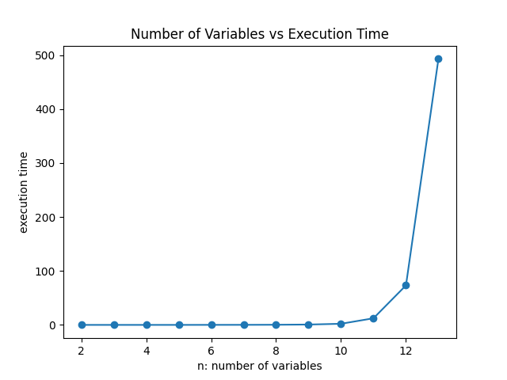

### Team Member

Chiao Lu 204848946

Zhe Zeng 605243830

Liunian Li 005271406

# Shor
...
# QAOA

## Usage

This python script can be used to perform two things:

1. Run benchmarks on QAOA algorithm implemented in Cirq that study how n affects the execution time
2. Run QAOA algorithm with your custom Max2SAT instance

To run the benchmark, do

```bash
python3 ./QAOA.py --benchmark
```

To run QAOA algorithm on your custom input Max2SAT, do

``` bash
python3 ./OAQA.py --custom2SAT --str_repr <your-2SAT-String> -n <num_variables> -m <num_clauses>
```
Where `n` is the number of variables and `m` is the number of clauses.

The format of \<your-2SAT-String> is ...
TODO: Harold


## Understanding the Output


### Benchmark
To study "how n affects the execution time", we run the QAQA on randomly generated Max2SAT instance with n from 2 to 14. We will print out the running time for each n and present a graph. The console output is quite self-explanatory.
```bash
We will study how n, the number of variables, affects the execution time of QAOA
We will vary n from 2 to 14
Begin benchmarking:
Testing n=2 and m=4
(v_0 OR v_1)  AND  (v_0 OR ~v_1)  AND  (~v_0 OR v_1)  AND  (~v_0 OR ~v_1)
The Max2SAT instance that we want to solve by QAQA is (v_0 OR v_1)  AND  (v_0 OR ~v_1)  AND  (~v_0 OR v_1)  AND  (~v_0 OR ~v_1)
It took 0.0035271644592285156 seconds for QAQA to solve

Testing n=3 and m=6
(~v_0 OR ~v_1)  AND  (v_0 OR ~v_2)  AND  (v_1 OR ~v_2)  AND  (~v_1 OR ~v_2)  AND  (v_0 OR v_2)  AND  (~v_1 OR v_2)
The Max2SAT instance that we want to solve by QAQA is (~v_0 OR ~v_1)  AND  (v_0 OR ~v_2)  AND  (v_1 OR ~v_2)  AND  (~v_1 OR ~v_2)  AND  (v_0 OR v_2)  AND  (~v_1 OR v_2)
It took 0.002757549285888672 seconds for QAQA to solve
...
...
Here's the graph that tells you how n and execution times relate
```


### Custom input 2SAT instance
The user can input a custom 2SAT instance...
TODO: Harold


## Report

### Present the design of how you parameterized the solution in n.

Our script supports dynamic generation of a custom 2SAT instance given the number of variables. With a given `n`, we can either generate by hand or generate randomly a Max2SAT instance. This Max2SAT instance is the fed to the QAQA solver.

The logic of generating random 2SAT instance for a given `n` is shown below
```python
def random_generate(self):
    current_clauses = set()
    while True:
        v_1 = random.randrange(0, self.n - 1)  # Sample the variable with smaller index
        v_1_negate = random.randrange(0, 2)  # Whether variable_1 is negated or not
        v_2 = random.randrange(v_1 + 1, self.n)  # Sample the variable with larger index
        v_2_negate = random.randrange(0, 2)  # Whether variable_2 is negated or not
        clause_tuple = (v_1, v_2, v_1_negate, v_2_negate)
        current_clauses.add(clause_tuple)
        if len(current_clauses) == self.m:
            break
    return list(current_clauses)
```
### Disucss your Effort to test the program
TODO: Harold...

### What is your experience with scalability as n grows? 

We noticed that the running time grows almost exponentially as `n` grows. Results below show how the running time in log scale increases as `n` increases.


