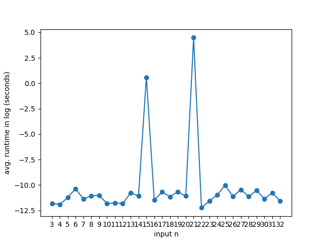
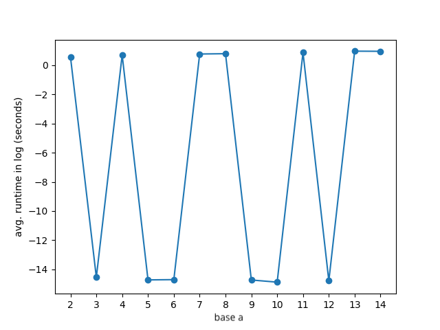

### Team Member

Chiao Lu 204848946

Zhe Zeng 605243830

Liunian Li 005271406

# Shor
## Usage

The python script `shor.py` can be used to perform two things:

1. Run the Shor's algorithm with a specifed integer `n` and it outputs an non-trivial prime facotr of `n`, for example, run

   ```shell
   python ./shor.py --max 10 15
   ```

   where the argument `--max` specifies the maximum number of trials in the Shor's algorithm, and `15` is the input integer to the algorithm such that the algorithm will return a non-trivial factor of it.

2. Run the Shor's algorithm on a range of problems to meaure how execution time changes as the input grows. For example, run

   ```shell
   python ./shor.py --max 10 --benchmark 32
   ```

   where the argument `--max` specifies the maximum number of trials in the Shor's algorithm for each input integer `n` in the range `[3, 32]`. There are two main measurements:

   i ) to measure how the execution time changes as the input integer `n` grows, where the execution time is averaged across ten trials by default.

   ii) to measure how for a fixed integer `n < 32 ` that actually calls the quantum subroutine, the execution time changes as the base `a` changes in the range `[2, n - 1]`.

## Understanding the Output

### Custom Input

The user can specify an integer `n` as input. For example, if we run 

```shell
python ./shor.py --max 10 15
```

We will get the following output:

```shell
finish in $t seconds
found factor $f for input integer 15
```

where `$t` is the total runtime and `$f` is `3` or `5` if the Shor's algorithm manages to find the factor in the `10` trials, otherwise we will get

```shell
finish in $t seconds
factor not found
```

### Benchmark

To study how the execution time is affected by the input `n` and the base `a` respectively, we will print out the execution time as averages over ten runs and the standard deviation, and save the graphs for execution time vs. input `n` as `shor_time_mean.png` and `shor_time_std.png` respectively, as well as the graphs for execution time vs. base `a` for a fixed `n` as `shor_{n}_time_mean.png` and `shor_{n}_time_std.png`.

## Report

### Present the design of how you parameterized the solution in n.

Our script supports user-specified input `n` by parameterizing each components in `n` as shown below.

```python
def run(n, n_trials=10, benchmark=False):    
    assert n > 1, f"the input integer should be greater than 1"
    if n % 2 == 0:
        return 2
    if isprime(n):  # n is a prime
        return n
    d = primepower(n)
    if d:  # n is the power of a prime
        return d
    for _ in range(n_trials):
      	a = random.randint(2, n - 1)
        d = math.gcd(a, n)            
        if 1 < d < n:
            return d  # d is a non-trivial factor of n
        r = find_order(a, n)
        if r is None or r % 2 != 0:
            continue
            x = (a ** (r // 2) - 1) % n
            d = math.gcd(x, n)
            if d > 1:
            	  return d
```

### Discuss your effort to test the program

We put the test for helper function `primepower` in `unit_test` to test the correctness and further verify the output factors for input integers in `[3, 32]` are correct to test our implemented program.

### What is your experience with scalability as n grows? 

The execution time (in log scale) vs. input integer `n` is presented as below.



We notice that the execution time peaks at two input, `15` and `21` respectively. This is because only these two inputs actually invokes the quantum subroutine. We also group the execution time by the bit lenght of input `n` as below, where we notice that an increase in the runtime as the input bit lenght increases, execept for input bit length 6 since in this group there is only result for `n = 32` that does not invoke the quantum subroutine.


We further look into how execution time (in log scale) changes as the base `a` in the quantum subroutine changes shown as below where the execution time varies a lot for different base.



#  QAOA

## Usage

This python script can be used to perform three things:

1. Run benchmarks on QAOA algorithm implemented in Cirq that study how n affects the execution time
2. Run QAOA algorithm with your custom Max2SAT instance
3. Run the QAOA algorithm on a range of randomly generated examples and compare its solutions to those of an exact solver.
To run the benchmark, do
```bash
python ./QAOA.py --benchmark
```

To run QAOA algorithm on your custom input Max2SAT, do

``` bash
python ./OAQA.py --custom2SAT --str_repr <your-2SAT-String> -n <num_variables> -m <num_clauses>
```
Where `n` is the number of variables and `m` is the number of clauses. Example usage:
``` bash
python QAOA.py --custom2SAT --str_repr "V0 OR V1 AND V1 OR ~V2 AND ~V1 OR V2 " -n 3 -m 3
```

To test QAOA against a exact solver, do
```bash
python ./QAOA.py --test_correct
```

## Understanding the Output


### Benchmark
To study "how n affects the execution time", we run the QAQA on randomly generated Max2SAT instance with n from 2 to 14. We will print out the running time for each n and present a graph. The console output is quite self-explanatory.
```bash
We will study how n, the number of variables, affects the execution time of QAOA
We will vary n from 2 to 14
Begin benchmarking:
Testing n=2 and m=4
(v_0 OR v_1)  AND  (v_0 OR ~v_1)  AND  (~v_0 OR v_1)  AND  (~v_0 OR ~v_1)
The Max2SAT instance that we want to solve by QAQA is (v_0 OR v_1)  AND  (v_0 OR ~v_1)  AND  (~v_0 OR v_1)  AND  (~v_0 OR ~v_1)
It took 0.0035271644592285156 seconds for QAQA to solve

Testing n=3 and m=6
(~v_0 OR ~v_1)  AND  (v_0 OR ~v_2)  AND  (v_1 OR ~v_2)  AND  (~v_1 OR ~v_2)  AND  (v_0 OR v_2)  AND  (~v_1 OR v_2)
The Max2SAT instance that we want to solve by QAQA is (~v_0 OR ~v_1)  AND  (v_0 OR ~v_2)  AND  (v_1 OR ~v_2)  AND  (~v_1 OR ~v_2)  AND  (v_0 OR v_2)  AND  (~v_1 OR v_2)
It took 0.002757549285888672 seconds for QAQA to solve
...
...
Here's the graph that tells you how n and execution times relate
```


### Custom input 2SAT instance
The user can input a custom 2SAT instance. For example, if we run the program with the following command:
```bash
python QAOA.py --custom2SAT --str_repr "V0 OR V1 AND V1 OR ~V2 AND ~V1 OR V2 " -n 3 -m 3
```
We will get the following output:
```bash
We will run QAQA with your custom input (v_0 OR v_1)  AND  (v_1 OR ~v_2)  AND  (~v_1 OR v_2)
The variable assignment we found: 
  v_0 : 0
  v_1 : 1
  v_2 : 1
```

### Correctness Test
We run an exact solver using the "exact_solve" function. We compare the soluction found by QAOA and the exact solver and we find that the algorithm is quite accurate.

We first randomly generate one example and then output the example and our solution; then we test QAOA on a range of randomly generated examples and compare its solutions to those of an exact solver.

Below is the output we get from running ``python ./QAOA.py --test_correct``:
```bash
##################### A Random Test Run #####################
(v_0 OR ~v_4)  AND  (v_1 OR v_4)  AND  (~v_2 OR v_5)  AND  (~v_2 OR ~v_3)  AND  (~v_0 OR v_1)  AND  (v_0 OR v_2)  AND  (~v_3 OR v_4)  AND  (v_3 OR ~v_4)  AND  (~v_4 OR ~v_5)  AND  (v_2 OR ~v_5)  AND  (~v_0 OR v_3)  AND  (v_0 OR ~v_1)  AND  (v_3 OR v_5)  AND  (v_1 OR ~v_5)  AND  (v_0 OR v_4)  AND  (~v_2 OR v_3)  AND  (~v_1 OR ~v_4)  AND  (~v_1 OR v_2)  AND  (v_0 OR ~v_3)  AND  (~v_0 OR v_2)  AND  (v_3 OR v_4)  AND  (~v_4 OR v_5)  AND  (~v_0 OR ~v_4)  AND  (v_2 OR v_5)  AND  (v_2 OR ~v_3)  AND  (v_0 OR v_1)  AND  (v_1 OR ~v_2)  AND  (v_2 OR ~v_4)  AND  (~v_0 OR v_5)  AND  (~v_3 OR ~v_5)  AND  (~v_0 OR ~v_5)  AND  (v_1 OR v_5)  AND  (~v_1 OR v_3)  AND  (~v_1 OR ~v_5)  AND  (v_4 OR ~v_5)  AND  (v_1 OR ~v_4)  AND  (~v_1 OR v_4)  AND  (v_0 OR v_3)  AND  (~v_0 OR ~v_1)  AND  (v_2 OR v_3)  AND  (~v_3 OR ~v_4)  AND  (v_1 OR v_2)  AND  (v_3 OR ~v_5)  AND  (v_0 OR ~v_5)  AND  (~v_3 OR v_5)  AND  (v_1 OR v_3)  AND  (~v_0 OR ~v_3)  AND  (v_2 OR v_4)  AND  (~v_2 OR ~v_4)  AND  (v_4 OR v_5)

The variable assignment we found: 
  v_0 : 1
  v_1 : 1
  v_2 : 1
  v_3 : 0
  v_4 : 0
  v_5 : 1

Max number of clause that can be satisfied: 40
Exact solver: 41


##################### Testing Correctness #####################
Out of 65 random test cases, the algorithm is completely correct for 48 of the cases.
Average difference with respect to the correct answer 0.3230769230769231
```


## Report

### Present the design of how you parameterized the solution in n.

Our script supports dynamic generation of a custom 2SAT instance given the number of variables. With a given `n`, we can either generate by hand or generate randomly a Max2SAT instance. This Max2SAT instance is the fed to the QAQA solver.

The logic of generating random 2SAT instance for a given `n` is shown below
```python
def random_generate(self):
    current_clauses = set()
    while True:
        v_1 = random.randrange(0, self.n - 1)  # Sample the variable with smaller index
        v_1_negate = random.randrange(0, 2)  # Whether variable_1 is negated or not
        v_2 = random.randrange(v_1 + 1, self.n)  # Sample the variable with larger index
        v_2_negate = random.randrange(0, 2)  # Whether variable_2 is negated or not
        clause_tuple = (v_1, v_2, v_1_negate, v_2_negate)
        current_clauses.add(clause_tuple)
        if len(current_clauses) == self.m:
            break
    return list(current_clauses)
```
### Disucss your Effort to test the program
We compare the results of our algorithm to an exact solver. On a wide range of completely randomly generated examples, we find that for the majority of the times, QAOA finds the exact solution and in cases when it does not, the approximated solution is very close to the gold solution. (See the previous section on Correctness Test)


### What is your experience with scalability as n grows? 

We noticed that the running time grows almost exponentially as `n` grows. Results below show how the running time in log scale increases as `n` increases.


