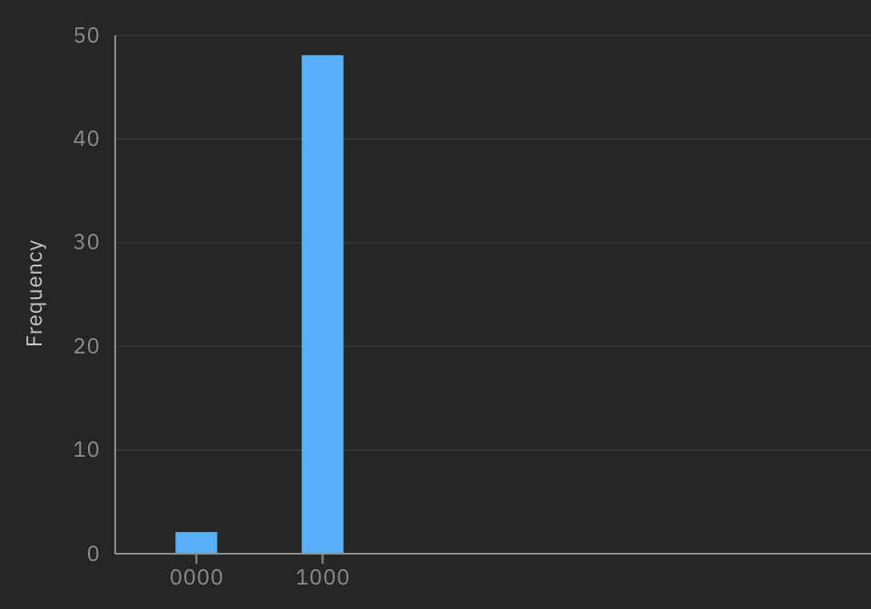
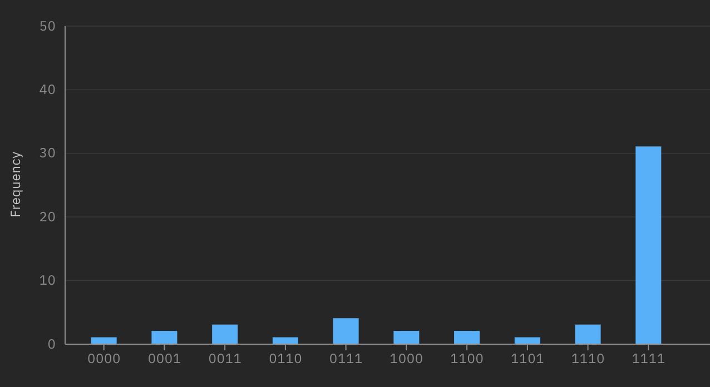
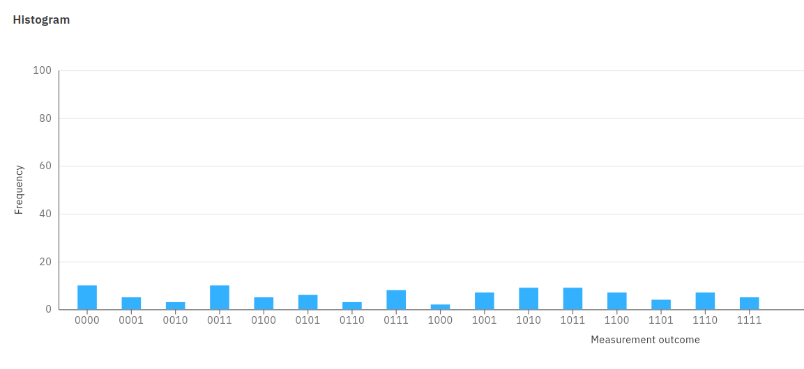

Chiao Lu: 204848946
Harold: UID
Zhe Zeng: 605243830

# Describe your approach to error correction.  Compare runs with and without error correction.

Following the approach in https://en.wikipedia.org/wiki/Quantum_error_correction#/(Bit flip code), we use two additional help qubits per input qubit to correct bit flip code. 

## BV

On the local simulation, we test the error correction by randomly flipping one of the input qubit or helper qubits. It turns out that the circuit output is robust to the random flip in the sense that the flip does not change the correctness of the circuit output and it remains the same as the case when there is no random flip.

On the IBM machine, we find that even with the error correction, the quantum computers are still error-prone. We run the Bernstein-Vazirani circuit for a hard-coded case with input bit length being one for multiple trials. The results is correct for 37 trials out of a total of 50 trials.

## DJ

On the local simulation, we test the error correction by randomly flipping one of the input qubit or helper qubits. It turns out that the circuit output is robust to the random flip in the sense that the flip does not change the correctness of the circuit output and it remains the same as the case when there is no random flip.

On the IBM machine, we find that even with the error correction, the quantum computers are still error-prone. We run the Deutsch-Josza circuit for a hard-coded case with input bit length being one for multiple trials. The results is correct for 38 trials out of a total of 50 trials.

## Grover
First we tried to implement the error correction (bit flip) discussed in lecture notes; however, we were unable to find a way to "measure the two error syndrome qubits and correct the three qubits". So, we looked into https://en.wikipedia.org/wiki/Quantum_error_correction for alternatives.

Here, we implemented the error correction for bit flip error found in the above link. The simulator gave promising results: we manually introduced a bit flip error and the EC algorithm was able to detect and correct it.

Unfortunately, since we have a CCNOT gate in the error correction algorithm, we were unable to port it to Google's quantum computer.

The IBM quantum computer was able to execute the circuit, but the result somewhat makes sense. However, since the `shots` are a bit too low due to API limits, this conclusion is probably inconclusive.
## Simon
On local simulation, we find that the error error correction is correct in that it will not incorrectly change the original correct result. We test with two input qubits and the random generated string is 01. Both simulations with/without error correction could find the correct answer.

On IBM's computer, we find that the real quantum computers are still error-prone. Without error correction, the results from the quantum computer do not produce a valid answer (the linear solver fails with the returned parameters); with erro correction, the result we found is 10, which is wrong.

Google's computer does not support CCNOT so we cannot run error correction.

## QAOA
It turns out that QAOA requires at least 4 qubits to obtain a circuit that actaully makes sense (in terms of encoding a valid Max2SAT instance). This condition pretty much makes error correction, even in the simplest case, unrealistic. The reason is that we need 2 additional qubits to create 1 qubit, and this in turn requires $4\times 3 = 12$ qubits in total for our QAOA circuit; this won't run on real quantum computers.

## Shor

We did not perform error correction in the case of Shor's algorithm due to the fact that the resulting circuit of Shor's algorithm with error correction could be as large as 36 qubits, which could not be handled by the current machines in both IBM or Google.

# Discuss your effort to test the programs and present results from the testing. Run each program multiple times and present statistics of the results.
## BV

We test the case when the black-box function f has its coefficients being '1000'. Below is the result from the IBM machine, where only two out of 50 trials obtain the wrong answer.



## DJ

We test both the case when the black-box function f is a constant function and the case when function f is a balanced function. Here we first present the result on the IBM machine when f has its input with bit string length four and f is a balanced function. Only one out of 50 trials has the wrong output '0000'.



Below is another test result on the IBM machine when f has its input with bit string length four and f is a constant function. In this case, all the 50 trials obtain the correct answers.


## Grover
For all of the following tests, we set the needle to be 1 (i.e. f(1)=1).

### Cirq
For n=1, the result `Counter({'1': 5747, '0': 4253})` makes sense (random guessing).
For n=2...8, we are unable to get any result because Google's quantum computer cannot work with CCNOT gate.
For n=9, the Google's quantum computer server crashes (internal server error). So, we stopped increasing n.
### Qiskit
For n=1, the result is incorrect.
For n=2, the result is also incorrect.
For n=3, the result is also incorrect.
For n=4, the result is also incorrect.
We notice Qiskit produces a lot of errors.
The largest n we are able to run is n=4 before reaching IBM's limit. Below is a graph for n=4.


## Simon
We are able to run on IBM and below is the result we got from IBM. It seems the computer makes a lot of errors. 

On Google, the computer still makes errors. Out of 10000 runs, only 2053 of them gave the correct answer. The most frequent results produce the wrong answer 10 (the correct string is 01).
## QAOA
### Cirq
Doesn't run on Google because it uses CCNOT gate.
### Qiskit
## Shor

Unfortunately we are not able to test the Shor's algorithm on the IBM machine due to the runtime constraint, where we got the exception message as follows. 

```shell
qiskit.providers.ibmq.job.exceptions.IBMQJobFailureError: 'Unable to retrieve result for job 605706d8dffd076f047a9cac. Job has failed: Circuit runtime is greater than the device repetition rate. Error code: 8020.'
```

# What is your experience with scalability as n grows?  Present a diagram that maps n to execution time.

Not enough information for this section. As Google and IBM don't let us test this.
However, from our experience, we notice that n=9 will crash Google's server (response is 'Internal Server Error')

# Compare your results across the two quantum computers
## BV
## DJ
## Grover
### Cirq
On Google, we get resonable result with n=1 qubit. Anything above n=1 will not run because no support for CCNOT gate.
### Qiskit
On IBM, results are all wrong with/without error correction.
## Simon
On IBM, the results are all wrong with or without error correction.

On Google, the results seem almost random and is still wrong.

## QAOA
On IBM, we got pretty good results. It can be seen that the state 11 gets the most hits, which is the correct solution. 

Google does not support CCNOT gate so we are not able to get QAOA on Google.
## Shor

Unfortunately we are not able to test the Shor's algorithm on the IBM machine due to the runtime constraint, and either can we test it on the Google machine due to the controlled swap gates not supported.

# Compare your results from running Cirq programs on the Google quantum computer with your results from running those same Cirq programs on the simulator.
## BV

We run a case when n = 2 with the coefficient ground truth being '10'. Below are the results from the Google machine, from which we can tell that we mostly got wrong results.

```shell
Counter({'00': 6193, '10': 3530, '01': 171, '11': 106})
```

While on the local simulation, we got correct results at all the trials.

## DJ

We run a case when f is a constant function and n = 2, that is, the correct result should be '00'. Below are the results form the Google machine, from which we can see that we can get the correct results most of the time.

```shell
Counter({'00': 8820, '01': 917, '10': 239, '11': 24})
```

While on the local simulation, we got correct results at all the trials.

## Grover
For n=1 both Google and simulator produced resonable results. Anything above n=1, we notice only simulator can run because of CCNOT gate.
## Simon
The results from Google is still very unstable. On simulators, we can get the correct answer on very few trys but on Google, the results do not seem to improve even if we increase the number of runs, possbily due to very high error rates.
## QAOA
Simulator gives good results. But Google's quantum won't run the circuit because of CNOT.
## Shor

Simulator gives good results. But Google's quantum won't run the circuit because controlled swap gates are not supported.

# how to provide input, how to run the program, and how to understand the output
## BV

To test on the IBM machine, run the following command with `-n` specifying the input bit string length.

```shell
python qiskit/bernstein.py -n $N
```

To further run on local simulation, you can add `-s` to the command.

To test on the Google machine, run the following command with `-n` specifying the input bit string length.

```shell
python cirq/bernstein.py -n $N
```

To further run on local simulation, you can add `-s` to the command.

## DJ

To test on the IBM machine, run the following command with `-n` specifying the input bit string length.

```shell
python qiskit/deutsch.py -n $N
```

To further run on local simulation, you can add `-s` to the command.

To test on the Google machine, run the following command with `-n` specifying the input bit string length.

```shell
python cirq/deutsch.py -n $N
```

To further run on local simulation, you can add `-s` to the command.

## Grover
Both versions will return/print the `job_id` for result lookup.

### Google
Here is the description:
```python
    argparser.add_argument('-c', '--custom_function', action='store_true',
                           help='Run Grover algorithm with custom input function',
                           default=False)
    argparser.add_argument('-x', '--needle',
                           help='If --custom_function is set, set the x such that f(x)=1. This should be in decimal '
                                'format')
    argparser.add_argument('-n', '--num_bits', help='If --custom_function is set, set the number of bits that f(x) is '
                                                    'expecting')
    argparser.add_argument('-g', '--google', help='Run on Google\'s quantum computer', action='store_true',
                           default=False)
    argparser.add_argument('-e', '--error_correct',
                           help='If testing on Google, demo error correction of bit-flip using a hard-coded n=1 qubit example',
                           action='store_true',
                           default=False)
    argparser.add_argument('-l', '--lookup_google',
                           help='Do NOT run any quantum algorithm, just lookup the results on Google using UID and exit',
                           action='store_true',
```
### IBM
Here's the description:
```python
    argparser.add_argument('-c', '--custom_function', action='store_true',
                           help='Run Grover algorithm with custom input function',
                           default=False)
    argparser.add_argument('-x', '--needle',
                           help='If --custom_function is set, set the x such that f(x)=1. This should be in decimal '
                                'format')
    argparser.add_argument('-n', '--num_bits', help='If --custom_function is set, set the number of bits that f(x) is '
                                                    'expecting')
    argparser.add_argument('-i', '--ibm', help='Run on IBM\'s quantum computer', action='store_true',
                           default=False)
    argparser.add_argument('-e', '--error_correct',
                           help='If testing on IBM, demo error correction of bit-flip using a hard-coded n=1 qubit example',
                           action='store_true',
                           default=False)

```
## Simon
To test on IBM, simply run "python qiskit/simon.py" and the program will ran an example. It will first run a simulation and then connect IBM to run the quantmn computer. It will run two versions: simulated and IBM.

To test on Google, simply run "python qiskit/QAOA.py" and the program will ran an example. It will first run a simulation and then connect Google to run the quantmn computer. After we get the job id and the run finishes on Goolge, we could call check_result_with_ids() to solve the retured results.

## QAOA
To test on IBM, simply run "python qiskit/QAOA.py" and the program will ran an example. It will first run a simulation and then connect IBM to run the quantmn computer. It will run four versions: 1) simulated, 2) simulated-error-correction, 3) IBM, and 4) IBM-error-correction.

## Shor

To run the Shor's algorithm in Cirq, you can use the command "python cirq/shor.py 15"; to run the Shor's algorithm in Qiskit, you can simple use the command "python cirq/shor.py".

# Which modifications of the programs did you have to make when moving from the simulator to the quantum computer?
Work on this together. Make some bullet points first
1) Remove custom gates
2) 